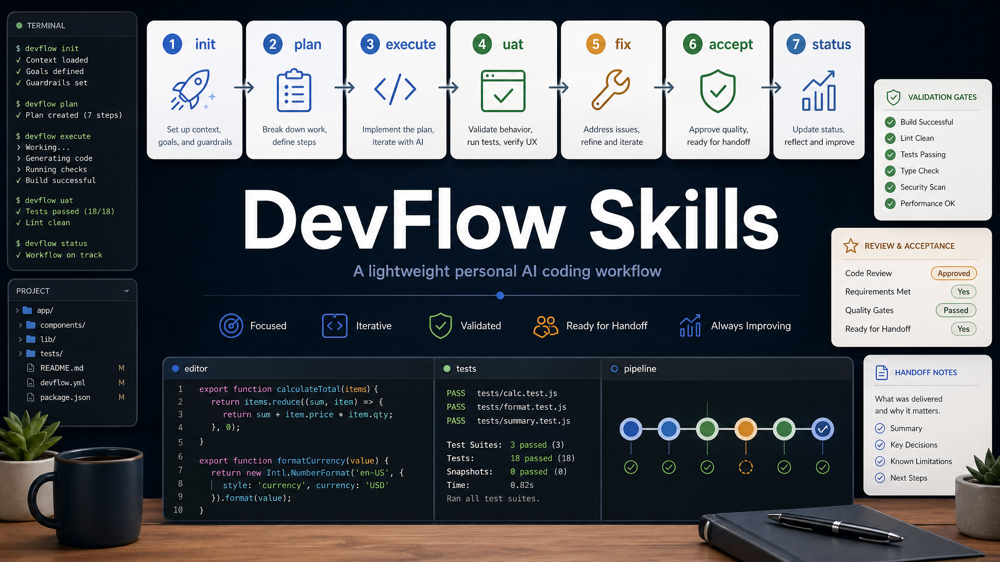

<div align="center">

# DevFlow Skills



[English](./README.en.md) · **中文**

**面向个人开发任务的轻量、可恢复、人在环 AI 编码工作流**

<p>
  
  
  
</p>

</div>

---

## 安装

```bash
npx skills add https://github.com/Yinghai75/devflow-skills
```

安装后，从一个明确开发目标开始：

```bash
/df-init
```

如果已经在 DevFlow feature 中工作，可以按阶段继续：

```bash
/df-plan
/df-execute
/df-uat
/df-fix
/df-accept
```

需要跨会话保存或恢复上下文时：

```bash
/df-status
/df-status -r
```

---

## DevFlow 是什么

DevFlow 是一组个人开发用的轻量 workflow skills。它不追求全自动代理编排，而是把一次开发任务拆成可读、可恢复、可验证的 feature 生命周期。

核心目标：

- 把目标、约束、计划、验证和 UAT 证据落到项目文件里。
- 让任务可以跨会话恢复，而不是依赖聊天上下文。
- 对高风险改动保守升级，要求计划、RED 证据、防炸门禁和发布闭环。
- 保留人在环决策点，避免 agent 在目标不清时盲目推进。

---

## Skills 总览

| Skill | 作用 |
| --- | --- |
| `df-init` | 启动 feature，创建 `devflow/active/<date-slug>/`，收敛目标、约束、成功标准和风险车道。 |
| `df-plan` | 编写 `plan.md`、`checklist.yaml`、`validation.md`，为高风险任务生成 Blast Radius Guard 和验证门禁。 |
| `df-execute` | 按 checklist 实施任务，更新状态、证据和 handoff，适合跨会话持续推进。 |
| `df-uat` | 引导人工 UAT，把验收问题记录到 `issues.yaml`。 |
| `df-fix` | 对 UAT issue 执行调查、修复、验证和回归闭环。 |
| `df-accept` | 检查 checklist、UAT issue、验证证据和风险门禁，通过后归档 feature。 |
| `df-status` | 保存当前断点，或在新会话中恢复 DevFlow 上下文。 |

---

## 推荐工作流

```text
df-init -> df-plan -> df-execute -> df-uat -> df-fix -> df-accept
```

`df-status` 是横向能力：

- 开发中断前运行 `df-status`，更新 `handoff.md`。
- 新会话中运行 `df-status -r`，恢复当前 feature 的目标、计划、状态和下一步。

---

## 适用场景

- 多文件开发任务，需要明确计划和验收。
- 高风险改动，需要影响面、防炸门禁和发布闭环。
- 跨会话任务，需要把状态落到仓库文件。
- 人工 UAT 驱动的问题发现和修复闭环。
- 希望保留轻量流程，但不想引入重型规格系统的个人项目。

---

## 仓库结构

```text
.
├── df-init/
├── df-plan/
├── df-execute/
├── df-uat/
├── df-fix/
├── df-accept/
├── df-status/
└── asset/
```

每个 `df-*` 目录都是一个独立 skill，入口文件为 `SKILL.md`。

---

## 许可

MIT

