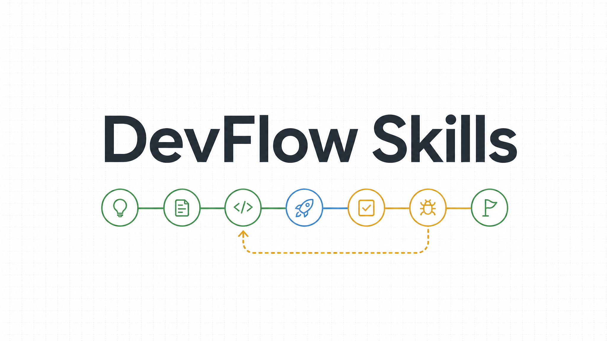

<div align="center">

# DevFlow Skills



[English](./README.en.md) · **中文**

**个人开发者的轻量 AI 编码工作流：11 个 skills，约 1,050 行指令，覆盖 feature 计划、执行、AI review、UAT、修复、归档与恢复**

<p>
  
  
  
  
</p>

</div>

---

## 为什么做 DevFlow

DevFlow 解决的是一个很窄的问题：

**一个人 + 一个 coding agent，把一次开发任务稳定推到可验收、可恢复、可归档。**

它不是重型规格平台，也不是“让 agent 接管整个项目”。DevFlow 把状态写进仓库，把每个阶段的授权、证据和断点落成文件，让换会话、返工、UAT 失败和线上发布都能回到同一套事实。

按当前公开仓库粗略统计：

| 框架 | 主要单元 | 子代理配置 | 粗略指令量 |
| --- | --- | --- | --- |
| [Superpowers](https://github.com/obra/superpowers) | 14 个 skills | 1 个 agent 文件 | 约 3,200 行 |
| [GSD](https://github.com/gsd-build/get-shit-done) | 99 个 workflows | 33 个 agent 文件 | 约 47,600 行 |
| **DevFlow** | **11 个 skills** | **5 类精简子代理角色** | **约 1,050 行** |

核心取舍：

- **状态落仓库**：目标、计划、checklist、UAT、issue、证据、断点和归档记录都在 `devflow/`。
- **计划和执行分离**：`df-plan` 完成后停在审阅点；只有显式 `$df-execute` 或同等执行语义才允许动代码。
- **上下文分层读取**：先读 `codebase_map/OVERVIEW.md`，再只读命中的模块卡片；不把全库地图塞进上下文。
- **证据先于断言**：关键门禁必须由脚本或 runtime probe 产生证据；自然语言“已通过”不算。
- **UAT 问题闭环**：人工反馈先完整 intake，再按 issue 进入 `df-fix`，避免边记边修漏问题。

---

## 安装

### Skills CLI（推荐）

```bash
npx skills add https://github.com/Yinghai75/devflow-skills
```

适用于支持 `npx skills` 安装 GitHub skill 仓库的 agent 环境，例如 Codex CLI、Claude Code 等。

### 手动安装

```bash
# Codex CLI
mkdir -p ~/.codex/skills
git clone https://github.com/Yinghai75/devflow-skills.git /tmp/devflow-skills-codex
cp -R /tmp/devflow-skills-codex/df-* ~/.codex/skills/
mkdir -p ~/.codex/local/devflow
cp -R /tmp/devflow-skills-codex/runtime/* ~/.codex/local/devflow/

# Claude Code
mkdir -p ~/.claude/skills
git clone https://github.com/Yinghai75/devflow-skills.git /tmp/devflow-skills-claude
cp -R /tmp/devflow-skills-claude/df-* ~/.claude/skills/
```

其他 agent：将 `df-*` 目录复制到对应 skills 路径即可。每个 `df-*` 目录都是独立 skill，入口为 `SKILL.md`。

### Runtime helper

`df-plan`、`df-status`、`df-uat` 和门禁执行会调用 `~/.codex/local/devflow/devflow_cli.py`。如果安装方式只复制了 `df-*`，还需要把仓库里的 `runtime/` 同步到 `~/.codex/local/devflow/`。

---

## 快速上手

```bash
/df-plan        # 启动并规划 feature：必要时先做 pre-plan discovery，再写计划和能力覆盖矩阵
/df-backlog     # 先不做：把新想法登记到 roadmap/backlog，不打断当前 feature
/df-codebase-map # 维护代码地图：OVERVIEW + 命中模块卡片，节省上下文
/df-constraint-audit # 查约束漂移：审计门禁、状态语义、接口契约是否重复或矛盾
/df-execute     # 显式授权后执行 checklist，并反推确认目标没有漏实现
/df-review-loop # 自动 Codex review 循环：审查 diff、修阻断项、复审和止损
/df-status -r   # 新会话恢复：读取当前 feature、计划和断点
/df-uat         # 人工验收：引导真实路径 UAT，完整登记本轮反馈
/df-fix         # 修复 UAT issue：分流、RED、修复、验证、关闭 issue
/df-regression  # 验收后回归：处理已归档 feature 的追加 UAT 问题
/df-accept      # 最终归档：检查门禁、UAT、地图、truth doc、golden set 后归档
```

---

## 工作流

```text
┌─────────┐    ┌────────────┐    ┌────────┐    ┌───────────┐
│ df-plan │───▶│ df-execute │───▶│ df-uat │───▶│ df-accept │
└─────────┘    └────────────┘    └────────┘    └───────────┘
     │              ▲                │              │
     ▼              │                ▼              ▼
┌────────────┐ ┌────────────────┐ ┌────────┐    ┌───────────────┐
│ df-backlog │ │ df-codebase-map │ │ df-fix │◀──│ df-regression │
└────────────┘ └────────────────┘ └────────┘    └───────────────┘

df-status：任意阶段保存断点 / 新会话 df-status -r 恢复
df-constraint-audit：任意阶段只读审计约束漂移
```

风险车道由 `df-plan` 分诊：

- **fast**：低风险文档、小修复、纯展示或局部逻辑。
- **standard**：常规多文件开发，按 plan → execute → UAT → fix → accept 推进。
- **high-risk**：状态机、线上发布、数据写入、跨模块编排、真实浏览器或外部站点路径；要求 RED 证据、防炸门禁和发布闭环。

### 验证层次

DevFlow 把验证分为几个不同概念，避免 verify / validate / review 等术语混淆：

| 概念 | 含义 | 执行阶段 | 产物 |
|------|------|----------|------|
| **validation**（机器验证） | 测试、构建、门禁脚本、runtime probe | df-execute、df-fix | `evidence/manifest.json` |
| **coverage verification**（覆盖核验） | 只核验 `Capability Coverage Matrix` 中的用户可见能力是否都有实现、validation、UAT、不可替代证据或 waiver | df-execute | `handoff.md` 覆盖摘要、`review-findings.yaml` coverage findings |
| **AI review loop**（代码审查循环） | `codex exec review`、P0/P1/P2 分流、修复复审、waiver 和止损；stop-loss 通过 `dependency_scope` 分流为整 feature 停止、仅当前项冻结或后置跟进 | df-review-loop、df-execute、df-fix | `evidence/reviews/`、`review-findings.yaml` |
| **UAT**（人工验收） | 真实路径、真实环境、人工操作和观察 | df-uat | `uat.md` 记录 |
| **accept audit**（归档审计） | 证据完整性、覆盖率、stale gate | df-accept | `acceptance.md` |

没有独立的"verify"阶段。`Capability Coverage Matrix` 是唯一覆盖事实源；coverage verification、coverage review、issue closure 和 accept audit 都只核验这张矩阵。`verifier` 是 df-execute 和 df-fix 中的子代理角色名，负责执行 validation 门禁、复核 review 证据和运行态证据；AI diff 审查由 `df-review-loop` 统一处理，止损后是否继续后续项按 `dependency_scope` 分流。

`df-plan` 也是 pre-plan discovery 入口，覆盖 new project bootstrap、brownfield、仓内 greenfield 和 architecture adjustment 回流。边界不清时先澄清用户/角色、产品形态、技术栈、架构边界、合同和首个垂直切片；清楚后才写正式计划。`df-plan` 不执行技术栈脚手架，脚手架任务交给 `$df-execute`。

---

## 当前机制

### Roadmap 续跑兼容

`df-plan` 从 `devflow/roadmap.md` 续跑时按优先级选择：`下一项`，再到 `未开始`；每个状态内先匹配标准 `状态：...` 行，再匹配 legacy 裸标记。legacy 只用于没有独立状态行的旧条目；启动前必须补写成标准状态行。

### Runtime helper 与 issue 压缩

`runtime/devflow_cli.py` 是本仓库发布的确定性 helper 正本；本机副本位于 `~/.codex/local/devflow/`。`df-uat` 开始阶段和登记 issue 前的分层硬阻断由 `compact-issues` 执行，已关闭/延后 issue 和 legacy `REVIEW-*` 历史迁移到 feature-local `evidence/`，活跃 `issues.yaml` 只保留当前工作集和 `history_ref`。

### 分层 codebase map

`df-codebase-map` 维护 `devflow/shared/codebase_map/`：

- `OVERVIEW.md` 永远加载，限制 30 行以内，只放目录 atlas、依赖图和卡片索引。
- `modules/*.md` 每张卡片限制 30 行以内，只写关键文件、边界与风险、惯例与测试。
- `df-plan` / `df-fix` 只读 OVERVIEW 和命中的模块卡片，并在产物里记录 `map_modules_read`。
- `df-execute` / `df-fix` 每次 git checkpoint 后只增量刷新命中的卡片。
- `df-accept` 做最终 stale gate，确认本 feature 命中的卡片已经刷新。

这套机制的目标是减少上下文占用：通用层只给 atlas，细节层只读和当前路径相关的几张卡片。

### 平台与契约证据闸

新增或改变平台能力、公开 API、DSL/配置语法、权限声明、运行环境假设或跨模块契约时，不能靠推理直接写实现。

可用证据只包括：

- 近邻精确既有模式。
- 官方文档。
- runtime probe。

找不到证据时只能调查或加 probe，不能直接实现。mock 单测不能证明平台能力存在。

### 唯一事实源和约束审计

`df-plan` 要求 `checklist.yaml` 和 `validation.md` 中的门禁行为、状态码语义和接口契约使用“脚本路径 + 通过/失败条件行号”的引用格式，避免自然语言复述脚本逻辑。

`df-constraint-audit` 只读扫描当前 feature 的 DevFlow 产物，重点查：

- 门禁描述与 Python 脚本实际行为是否矛盾。
- `state.yaml`、`acceptance.md`、`handoff.md`、`issues.yaml`、`uat.md` 是否状态漂移。
- 同一门禁行为、接口契约或状态语义是否被多处重复描述。

### UAT intake 先于转修

`df-uat` 不只是登记问题，也负责引导真实环境人工验收。一次用户反馈里有多个异常、截图、字段错误、会话现象或复测结论时，必须先完成整批 intake：

- 拆成用户可见失败面。
- 去重、重开或登记 issue。
- 同步更新 `issues.yaml`、`uat.md`、`handoff.md`、`state.yaml`。
- 开始阶段和登记前先压缩过大的活跃 `issues.yaml`，查重同时读取 `history_ref` 与 evidence 历史文件。
- 用户说“只记录”“先只读”“不要修”时，记录后停下。

只有本轮反馈全部入账后，才允许选择一个明确 issue id 进入 `df-fix`。

### df-fix 分流和止损

`df-fix` 面向当前 active feature 的 open UAT issue，先分流再改代码：

- **fast-fix**：极小、低风险、根因清楚；可走快速 RED → patch → targeted test → 原子提交。
- **scoped-fix**：默认车道；当前 feature 影响面内的受控回归。
- **high-risk-fix**：跨 Dify、插件、Broker、`nas-agent`、`erp-executor`、容器、发布链路或真实运行态；默认只能调查，写明收窄理由后才允许单点补丁。
- **integration-debug**：跨 3+ 运行中组件或同一 issue 多轮多环节仍未关闭；只加探针和读运行态快照，定位单一断点后再降级修复。

改代码前必须落盘 `fix_lane`、`q1_causal_chain`、`q2_regression_list`、`q3_platform_assumptions`，长诊断和 review/rework 流水写入 `evidence/` 或 `handoff.md`，`issues.yaml` 只保留当前摘要、状态、复测标记、最新证据路径和 `history_ref`。最终回复先给人话状态；只有任务涉及发布、运行态或 UAT 时才强制说明本地/远端发布与 UAT 可行性，工具链、skill、文档或只读评估任务只说明“不涉及业务发布/UAT”和下一步。每轮修复尝试后必须 git checkpoint；命中止损时写 `doom_loop_breaker`，再由用户选择回 `df-plan` 或继续探针定位。

### 子代理分派

`df-execute` 默认把主模型 token 留给决策和编排，代码实现交给边界清楚的子代理：

- 搜索、定位、比较：`explorer`。
- 实现代码：`executor`，未注册时回退 `worker`。
- 跑门禁、复核 review 证据和运行态证据：`verifier`。
- 计划缺口：`planner` 或回到 `df-plan`。

`df-fix` 更保守：主代理保留 issue 判定、车道分流、`q1/q2/q3`、止损、关闭 issue 和最终状态；子代理只做边界清楚的定位、窄补丁和验证。同一用户可见失败面的核心修复不得并发多个 executor。

执行或修复过程中如果发现必须改变模块职责、公共合同、状态归属、数据流方向、共享抽象或部署边界，必须暂停当前 checklist 或 fix，记录证据并回到 `df-plan` 做 architecture adjustment；不得在 `df-execute` 或 `df-fix` 中顺手重构。

---

## Skills 总览

| Skill | 做什么 | 产出什么 |
| --- | --- | --- |
| `df-plan` | 启动并规划 feature；必要时先做 new project bootstrap / pre-plan discovery，目标清楚后写计划和 `Capability Coverage Matrix`。 | `context.md`、`plan.md`、`checklist.yaml`、`validation.md`、`uat.md`、`state.yaml` |
| `df-backlog` | 登记不应打断当前 feature 的新事项。 | 更新 `devflow/roadmap.md` |
| `df-codebase-map` | 维护分层代码地图：OVERVIEW + 命中模块卡片。 | `devflow/shared/codebase_map/` |
| `df-constraint-audit` | 只读审计门禁描述、状态语义和接口契约是否与事实源漂移。 | 约束问题清单、建议唯一事实源 |
| `df-execute` | 显式授权后按 checklist 执行，先跑 targeted test，再提交和更新证据，并证明 feature 目标没有漏实现。 | 代码改动、提交、`evidence/manifest.json`、`handoff.md` |
| `df-review-loop` | 用 `codex exec review` 自动审查 diff，按 P0/P1/P2 修复、复审、waiver 或止损；非 Codex 环境写 `tooling_blocked`，不能冒充 PASS。 | `evidence/reviews/`、`review-findings.yaml` |
| `df-status` | 保存断点，或在新会话恢复当前 feature。 | `handoff.md`、恢复上下文 |
| `df-uat` | 引导人工 UAT，完整登记本轮反馈和 UAT issue。 | `uat.md`、`issues.yaml` |
| `df-fix` | 修复 active feature 的 UAT issue，完成 RED、修复、验证、关闭和回归记录。 | 修复提交、issue 关闭记录、验证证据 |
| `df-regression` | 处理已归档 feature 的验收后追加回归或新增 UAT issue。 | archive feature 内的 regression issue、证据和关闭记录 |
| `df-accept` | 最终验收并归档，检查 checklist、UAT、门禁、review 证据、codebase map、truth doc 和 golden set。 | `acceptance.md`、`devflow/archive/` |

---

## 运行时目录

运行 `df-plan` 后，你的仓库会出现：

```text
your-repo/
└── devflow/
    ├── active/
    │   └── 2026-05-01-add-login/     # 当前 feature
    │       ├── context.md             # 目标、约束、成功标准、map_modules_read
    │       ├── plan.md                # 实施方案和边界
    │       ├── checklist.yaml         # 可逐项执行的任务清单
    │       ├── validation.md          # 验证方案 + 防炸门禁
    │       ├── state.yaml             # 当前状态、授权和断点
    │       ├── handoff.md             # 跨会话交接
    │       ├── uat.md                 # UAT 项和复测记录
    │       ├── issues.yaml            # 当前 UAT 活跃问题视图
    │       ├── review-findings.yaml   # AI review findings、waiver 和最终状态
    │       ├── acceptance.md          # 验收报告
    │       └── evidence/              # 机器证据和历史归档
    │           ├── manifest.json
    │           └── reviews/           # df-review-loop 每轮输出
    ├── archive/                       # 已归档 feature
    ├── roadmap.md                     # 长目标 backlog
    └── shared/
        ├── gate_registry.yaml         # 门禁注册表
        ├── golden_sets/               # 黄金样本
        └── codebase_map/              # OVERVIEW + modules/*.md
```

这些文件是正本状态。agent 读它们恢复上下文，人也可以直接审阅、修改或接管。

---

## 许可

MIT
