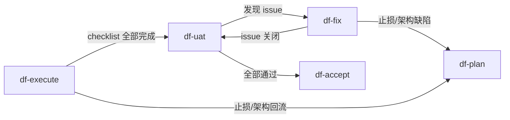

# DevFlow df-* Skills Review — 第三轮：术语体系与验证层次

> **审阅者**: Claude Opus 4.6 (Thinking)
> **审阅时间**: 2026-05-14
> **输入材料**: GPT 基于 mb-main 实际执行经验的分析 + 当前 `/Users/yinghai/SynologyDrive/codex/devflow/df-*/SKILL.md`
> **审阅重点**: 术语混乱风险、验证层次、UAT 职责分离、实际执行中的反馈闭环效率

---

## 一、GPT 分析的复核结论

### 1.1 ✅ "不存在独立 verify 阶段"——完全正确

GPT 说的对：当前 skills 中 validation / verifier / review / accept audit 这些词确实交叉出现，但 **并没有一个独立的 verify 阶段或 verify skill**。实际映射关系：

| 术语 | 出现位置 | 实际含义 |
|------|----------|----------|
| `validation` | `validation.md`、`df-plan` L98、`df-execute` L46-50 | 机器证据：门禁脚本、构建、测试、runtime probe |
| `verifier` | `df-execute` L84/L93、`df-fix` L74 | 子代理**角色名**，职责是跑门禁和审查 diff |
| `review` | `df-execute` L101-102 | 代码 diff 审查动作（`/review`），由 verifier 角色执行 |
| `accept audit` | `df-accept` 全文 | 最终归档前的检查清单 |
| `UAT 覆盖审计` | `df-uat` L105-111、`df-accept` L62-78 | 确认每个用户可见能力都有真实环境 UAT 项 |

**复核结论**：这套术语在**定义者**（写 skills 的人）视角下是清晰的，但在**消费者**（执行 skills 的 agent）视角下确实容易混淆。特别是 `validation`（产物文件名）和 `verifier`（子代理角色名）两个词根相同、职责交叉但不等价。

### 1.2 ✅ 四层模型是准确的心智模型

GPT 提出的四层模型：

```
1. df-execute：实现 + 实现期 validation
2. df-uat：人工/真实业务 validation
3. df-fix：UAT issue 的局部修复闭环，修完回 UAT
4. df-accept：最终归档审计，只在证据齐全时收口
```

**复核**：和当前 skills 的实际职责完全吻合。当前代码中的流转关系：



这个四层模型不需要改代码，但应该**写入文档**，作为使用者的心智模型参照。

### 1.3 ✅ "UAT 同时承担验证和缺陷发现"——是事实，不是问题

GPT 的分析很精准：

> UAT 一直发现 bug，不说明它不是 validation；说明它现在是 validation + 缺陷发现入口。

**我的补充**：对于 mb-main 这种涉及 Dify、插件、浏览器、ERP、外部官网、容器、远端发布的项目，大量 bug **只能在真实路径中暴露**，这是正常的。但 GPT 指出的一个关键改进方向我完全同意：

> 同类 bug 反复靠 UAT 发现就不正常，应该把它前移成 gate、golden sample、contract test 或 checklist 约束。

当前 `df-fix` 在 L100（`11d`）已经有这个机制：

> 修复改变了业务行为时，更新 `devflow/shared/golden_sets/` 中受影响的样本。

但这只是**样本更新**，不是**回归门禁前移**。缺的是一个显式的"把 UAT 发现的 bug 模式沉淀为机器 gate"的流程步骤。

---

## 二、针对 Skills 的具体改进建议

### 2.1 🔴 术语收敛：消除"verify"歧义

**现状**：`verify` 一词在 skills 中没有作为独立阶段出现，但"验证"这个中文词在不同 skill 中指代不同动作：

| skill | "验证"指的是 |
|-------|-------------|
| `df-execute` L38 | targeted test（机器测试 + 构建 + lint） |
| `df-execute` L47 | 门禁脚本执行（`run-gate`） |
| `df-uat` L3 | 人工验收 |
| `df-fix` L8 | 修复后复跑同一真实步骤 |
| `df-accept` L10 | 最终归档检查 |

**建议**：采纳 GPT 的口径收敛提议，在 skills 中只保留三个一级概念：

1. **validation**（机器验证）：测试、构建、门禁脚本、runtime probe → 产出 `evidence/`
2. **UAT**（人工验收）：真实路径、真实环境、人工操作 → 产出 `uat.md` 记录
3. **accept audit**（归档审计）：证据完整性、覆盖率、stale gate → 产出 `acceptance.md`

`verifier` 作为子代理角色名可以保留，因为它语义明确（跑 validation 的 agent），不会和阶段混淆。

**具体改动**：不需要改 skill 流程，只需要在以下位置加注释或标注：

- `df-execute` 中的"验证"改为"机器验证（validation）"
- `df-uat` 的 description 已经写了"人工 UAT"，不需要改
- `df-accept` 的 description 已经写了"最终验收"，不需要改
- README 的工作流图下方加一段术语约定

### 2.2 🔴 df-fix 补"回归门禁前移"步骤

**现状**：`df-fix` 在关闭 issue 时更新 golden set（L100），但没有要求把"发现 bug 的 UAT 路径"转化为机器可执行的回归门禁。

**问题**：这会导致同类 bug 在后续 feature 中仍然靠人工 UAT 发现，增加 UAT 轮次和修复成本。

**建议**：在 `df-fix` 流程第 10 步（更新记录）后增加一条：

> 10b. 若本 issue 揭示的失败模式可被机器检测（自动测试、contract gate、golden sample、lint 规则），在 `issues.yaml` 的 `regression_guard_contract` 字段记录新增的 gate 类型和路径引用。优先新增 gate 而非依赖人工 UAT 防回归。

这不需要每个 issue 都加 gate——只需要 agent 在关闭 issue 时**有意识地评估**"这个失败模式能否被前移"。

### 2.3 🟡 df-uat 区分"探索性 UAT"和"收口 UAT"

**GPT 的分析**：

> 你可以把 UAT 分成两个状态：
> - Bug-finding UAT：第一次跑真实路径，允许发现问题。
> - Acceptance UAT：修复后复测，应该主要确认通过。

**复核**：当前 `df-uat` 没有区分这两个状态，但实际上已经隐式支持了——`uat.md` 中每个 UAT 项有"当前状态"字段，可以记录"首测"和"复测"。

**建议**：不需要拆分 `df-uat` skill，但在 `uat.md` 模板中加一个字段：

```yaml
- id: UAT-001
  uat_phase: first_pass | retest  # 首测 vs 复测
  ...
```

并在 `df-uat` 的引导原则中加一条：

> 首测（first_pass）发现 bug 是正常的；复测（retest）阶段如果发现同类新 bug，应把该失败模式标记为 `regression_pattern`，提示用户在 `df-fix` 中前移为 gate。

### 2.4 🟡 df-execute 的 validation 强度需要与 UAT 发现率关联

**GPT 的核心洞察**：

> UAT 如果频繁发现基础 bug，就说明前面的 execute validation 不够强。

**现状**：`df-execute` 的 validation 强度由 `validation.md` 在计划阶段决定，执行期不会根据 UAT 反馈动态加强。

**建议**：在 `df-accept` 的检查项中增加一条回顾性检查：

> 16. 若本 feature 的 UAT 首测（first_pass）发现了 3 个或更多 issue，在 `acceptance.md` 中记录 `execute_validation_gap`：回顾哪些 issue 本可以在 execute 阶段通过更强的 gate 或 RED 测试发现，并将改进建议写入 roadmap 或下一个 feature 的 `validation.md` 参考。

这不是阻断条件，只是一个反思性检查项，帮助 DevFlow 持续改进 execute 阶段的门禁覆盖。

### 2.5 ✅ 四层心智模型写入 README

**建议**：在 README 的"工作流"节下方增加一段：

```markdown
### 验证层次

DevFlow 把验证分为三个不同概念，每个在不同阶段执行：

| 概念 | 含义 | 执行阶段 | 产物 |
|------|------|----------|------|
| **validation**（机器验证） | 测试、构建、门禁脚本、runtime probe | df-execute、df-fix | `evidence/manifest.json` |
| **UAT**（人工验收） | 真实路径、真实环境、人工操作和观察 | df-uat | `uat.md` 记录 |
| **accept audit**（归档审计） | 证据完整性、覆盖率、stale gate | df-accept | `acceptance.md` |

没有独立的"verify"阶段。`verifier` 是 df-execute 和 df-fix 中的子代理角色名，
负责执行 validation 中的门禁和 diff 审查。
```

---

## 三、对 GPT 几个提议的评价

### 3.1 ✅ "收敛 verify 口径"——同意，上面 2.1 节已给出具体方案

### 3.2 ✅ "UAT 发现 bug 是正常的"——同意

但需要补充：这个"正常"有一个隐含条件——**同类 bug 不应反复靠 UAT 发现**。当前 skills 缺少一个把 UAT 发现的 bug 模式前移为 gate 的显式流程（2.2 节已建议）。

### 3.3 ⚠️ "Bug-finding UAT vs Acceptance UAT"——方向对但不需要拆 skill

GPT 建议区分两种 UAT 状态。我同意概念上的区分（见 2.3 节），但不建议创建两个独立流程或 skill。原因：

1. 当前 `df-uat` 已经通过 `uat.md` 的"当前状态"字段隐式支持了首测/复测区分
2. 拆成两个流程会增加 agent 的决策负担——"我现在应该跑 bug-finding 还是 acceptance？"
3. 实际上复测中也可能发现新 bug（修复引入的回归），两种状态之间的边界并不清晰

**更好的方案**：在 `uat.md` 模板中加一个 `uat_phase` 字段（如 2.3 节所述），让 agent 自然标注，但不改变流程。

### 3.4 ✅ "把 UAT 失败面沉淀成回归门禁"——这是最重要的改进方向

GPT 说：

> 每次 UAT 发现 bug 后，df-fix 要把这个失败面沉淀成证据和回归门禁；否则 UAT 就会变成反复人工捞 bug。

这是当前 DevFlow skills 中**最大的结构性缺失**。`df-fix` 有 golden set 更新（L100），但缺少显式的"回归门禁前移"环节。见 2.2 节的具体建议。

---

## 四、与前两轮 Review 的关系

| 前轮问题 | 本轮关联 |
|----------|----------|
| Round 1 的 2.3（子代理分派矩阵重复） | 本轮不涉及，仍建议合并 |
| Round 1 的 2.4（df-execute 缺 doom_loop_breaker） | GPT 已修，✅ |
| Round 2 的 L21（roadmap 解析过于复杂） | 本轮不涉及，仍建议简化 |
| Round 2 的 P4（F1-F4 编号） | 本轮不涉及 |
| **本轮新增** | 术语收敛、回归门禁前移、UAT 阶段标注、execute validation gap 回顾 |

---

## 五、改动优先级总结

| # | 改动 | 优先级 | 理由 |
|---|------|--------|------|
| **T1** | 术语约定写入 README（2.5 节） | 🔴 高 | 零代码改动，立即降低使用者困惑 |
| **T2** | df-fix 补"回归门禁前移"步骤（2.2 节） | 🔴 高 | 这是 GPT 分析指出的最大结构缺失 |
| **T3** | df-uat 加 `uat_phase` 字段建议（2.3 节） | 🟡 中 | 改模板 + 加一条引导原则 |
| **T4** | skill 中"验证"措辞标注（2.1 节） | 🟡 中 | 多处小改，可渐进式完成 |
| **T5** | df-accept 补 `execute_validation_gap` 回顾（2.4 节） | 🟢 低 | 反思性改进，不阻断当前流程 |

---

## 六、总结

GPT 基于 mb-main 的实际执行体验做出了准确的分析。核心问题不是"重复验证"，而是**两个层面**：

1. **术语层面**：validation / verifier / review / accept audit 交叉使用，让 agent（和人）难以建立清晰的心智模型。解法是收敛术语、写入文档。

2. **流程层面**：UAT 反复发现同类 bug 的根因是"execute 阶段的 gate 覆盖不够 + fix 阶段没有显式的回归门禁前移"。解法不是加阶段，而是在现有 df-fix 中加一个"沉淀回归门禁"的步骤。

四层模型（execute → uat → fix → accept）是对的，不需要改流程，但应该作为使用者心智模型写入文档。
